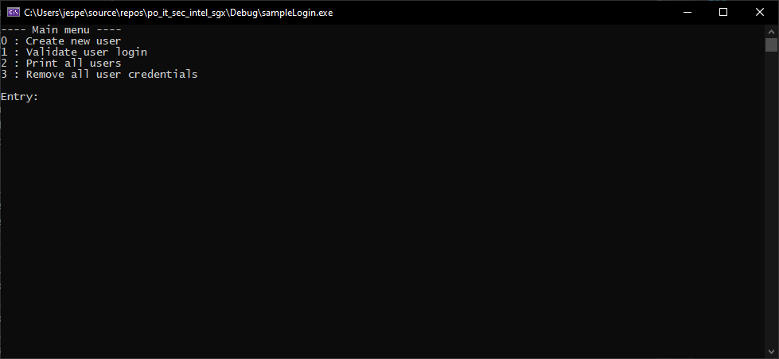

<!-- PROJECT SHIELDS -->
<!--
*** I'm using markdown "reference style" links for readability.
*** Reference links are enclosed in brackets [ ] instead of parentheses ( ).
*** See the bottom of this document for the declaration of the reference variables
*** for contributors-url, forks-url, etc. This is an optional, concise syntax you may use.
*** https://www.markdownguide.org/basic-syntax/#reference-style-links
-->
[![Contributors][contributors-shield]][contributors-url]
[![Forks][forks-shield]][forks-url]
[![Stargazers][stars-shield]][stars-url]
[![Issues][issues-shield]][issues-url]
[![MIT License][license-shield]][license-url]


<!-- PROJECT LOGO -->
<br />
<p align="center">
  <a href="https://github.com/enclaive/sgx_liblogin">
    
  </a>

  <h3 align="center">sgx_liblogin</h3>

  <p align="center">
    An exemplary Implementation of a Library for Logins using Intel SGX.
    <br />
    <a href="https://github.com/enclaive/sgx_liblogin"><strong>Explore the docs »</strong></a>
    <br />
    <br /><!-- 
    <a href="https://github.com/enclaive/sgx_liblogin">View Demo</a>
    · -->
    <a href="https://github.com/enclaive/sgx_liblogin/issues">Report Bug</a>
    ·
    <a href="https://github.com/enclaive/sgx_liblogin/issues">Request Feature</a>
  </p>
</p>


<!-- TABLE OF CONTENTS -->
<details open="open">
  <summary><h2 style="display: inline-block">Table of Contents</h2></summary>
  <ol>
    <li>
      <a href="#about-the-project">About The Project</a>
      <ul>
        <li><a href="#built-with">Built With</a></li>
      </ul>
    </li>
    <li>
      <a href="#getting-started">Getting Started</a>
      <ul>
        <li><a href="#prerequisites">Prerequisites</a></li>
        <li><a href="#installation">Installation</a></li>
      </ul>
    </li>
    <!-- <li><a href="#usage">Usage</a></li> -->
    <li><a href="#roadmap">Roadmap</a></li>
    <li><a href="#contributing">Contributing</a></li>
    <li><a href="#license">License</a></li>
    <li><a href="#contact">Contact</a></li>
    <!-- <li><a href="#acknowledgements">Acknowledgements</a></li> -->
  </ol>
</details>

<!-- ABOUT THE PROJECT -->
## About The Project



This project offers basic login functionality inside an enclave.

* A ```.csv```-File containing user credentials is created and sealed inside the enclave

* Password can be hashed inside the enclave

* For demonstration purposes a list of existing user credentials can be printed out or deleted.

This project has been developed as a part of the Flensburg University of Applied Science Applied Computer Science masters program.

### Built With

* [Intel SGX](https://www.intel.com/content/www/us/en/architecture-and-technology/software-guard-extensions.html)

* [SGX Crypto++](https://github.com/enclaive/sgx_cryptopp)

<!-- GETTING STARTED -->
## Getting Started

To get a local copy up and running follow these simple steps.

### Prerequisites

- Intel SGX

For installation instructions please refer to Intels setup-guides for [Windows](https://software.intel.com/content/www/us/en/develop/articles/getting-started-with-sgx-sdk-for-windows.html) or [Linux](https://github.com/intel/linux-sgx#introduction)
### Installation

1. Clone the repo
   ```sh
   git clone https://github.com/enclaive/sgx_liblogin.git
   ```
2. Build the project solution using Visual Studio 2019


<!-- USAGE EXAMPLES -->
## Usage
### Sample
Open the file **sgx_liblogin.sln** with Visual Studio and build the project **sampleLogin**.
This project is a win32 console application with following features:

* Create an user
* Validate user credentials
* Print all user
* Remove all user credentials


<!-- ROADMAP -->
## Roadmap

See the [open issues](https://github.com/enclaive/sgx_liblogin/issues) for a list of proposed features (and known issues).


<!-- CONTRIBUTING -->
## Contributing

Contributions are what make the open source community such an amazing place to be learn, inspire, and create. Any contributions you make are **greatly appreciated**.

1. Fork the Project
2. Create your Feature Branch (`git checkout -b feature/AmazingFeature`)
3. Commit your Changes (`git commit -m 'Add some AmazingFeature'`)
4. Push to the Branch (`git push origin feature/AmazingFeature`)
5. Open a Pull Request


<!-- LICENSE -->
## License

Distributed under the MIT License. See `LICENSE` for more information.


<!-- CONTACT -->
## Contact

Malte Jensen - malte.jensen@stud.hs-flensburg.de
Torsten Kiesel - torsten.kiesel@stud.hs-flensburg.de
Jesper Schwarz - jesper.schwarz2@stud.hs-flensburg.de

Project Link: [https://github.com/enclaive/sgx_liblogin](https://github.com/enclaive/sgx_liblogin)


<!-- ACKNOWLEDGEMENTS -->
<!-- ## Acknowledgements

* []()
* []()
* []()


<!-- MARKDOWN LINKS & IMAGES -->
<!-- https://www.markdownguide.org/basic-syntax/#reference-style-links -->
[contributors-shield]: https://img.shields.io/github/contributors/enclaive/sgx_liblogin.svg?style=for-the-badge
[contributors-url]: https://github.com/enclaive/sgx_liblogin/graphs/contributors
[forks-shield]: https://img.shields.io/github/forks/enclaive/repo.svg?style=for-the-badge
[forks-url]: https://github.com/enclaive/sgx_liblogin/network/members
[stars-shield]: https://img.shields.io/github/stars/enclaive/repo.svg?style=for-the-badge
[stars-url]: https://github.com/enclaive/sgx_liblogin/stargazers
[issues-shield]: https://img.shields.io/github/issues/enclaive/repo.svg?style=for-the-badge
[issues-url]: https://github.com/enclaive/sgx_liblogin/issues
[license-shield]: https://img.shields.io/github/license/enclaive/repo.svg?style=for-the-badge
[license-url]: https://github.com/enclaive/sgx_liblogin/blob/master/LICENSE.txt
[product-screenshot]: images/screenshot.png
